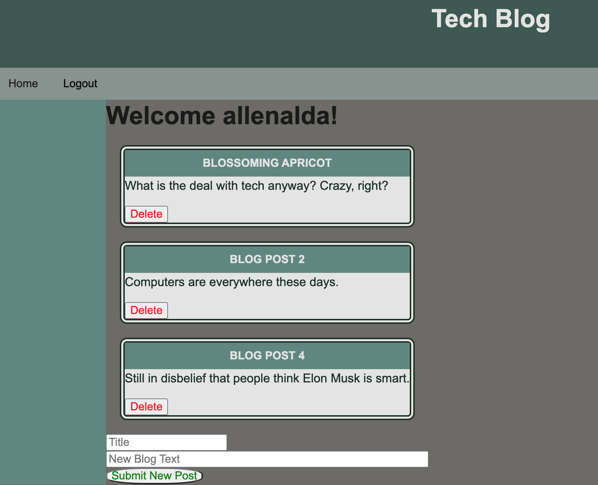

# Tech Blog

## Description
  This is a full stack tech blog, where users can post and delete blog entries.

## Table of Contents
- [Installation](#installation)
- [Usage](#usage)
- [License](#license)
- [Contributing](#contributing)
- [Tests](#tests)
- [Questions](#questions)

## Installation
This application is hosted on a heroku server, so no installation is necessary.

## Usage
To use this application, go to https://matstechblog.herokuapp.com/ and log in or sign up. Once logged in, the user will be able to enter a title and text for a new blog post. When a new post is submitted, it will append to the end of the list. Each post has a Delete button which will delete the post from the database and refresh the page.

## License
  

Copyright 2021 Mathew Lundin

Permission is hereby granted, free of charge, to any person obtaining a copy of this software and associated documentation files (the "Software"), to deal in the Software without restriction, including without limitation the rights to use, copy, modify, merge, publish, distribute, sublicense, and/or sell copies of the Software, and to permit persons to whom the Software is furnished to do so, subject to the following conditions:

The above copyright notice and this permission notice shall be included in all copies or substantial portions of the Software.

THE SOFTWARE IS PROVIDED "AS IS", WITHOUT WARRANTY OF ANY KIND, EXPRESS OR IMPLIED, INCLUDING BUT NOT LIMITED TO THE WARRANTIES OF MERCHANTABILITY, FITNESS FOR A PARTICULAR PURPOSE AND NONINFRINGEMENT. IN NO EVENT SHALL THE AUTHORS OR COPYRIGHT HOLDERS BE LIABLE FOR ANY CLAIM, DAMAGES OR OTHER LIABILITY, WHETHER IN AN ACTION OF CONTRACT, TORT OR OTHERWISE, ARISING FROM, OUT OF OR IN CONNECTION WITH THE SOFTWARE OR THE USE OR OTHER DEALINGS IN THE SOFTWARE.

  [MIT License](https://opensource.org/licenses/MIT)
    

## Contributing
This application was developed by Mat Lundin.

## Tests
No tests have been built for this application.

## Questions
 Any questions can be submitted to the developer via GitHub.

You can access this repository [here.](https://github.com/mat-lundin/Homework-14-Tech-Blog)

